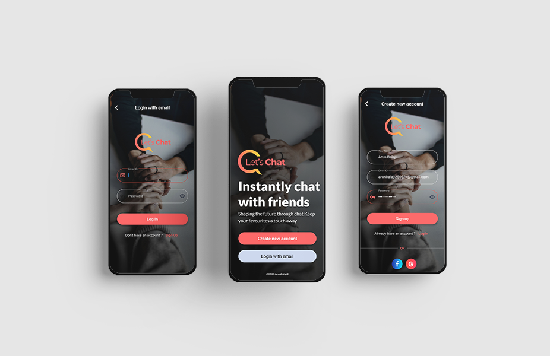
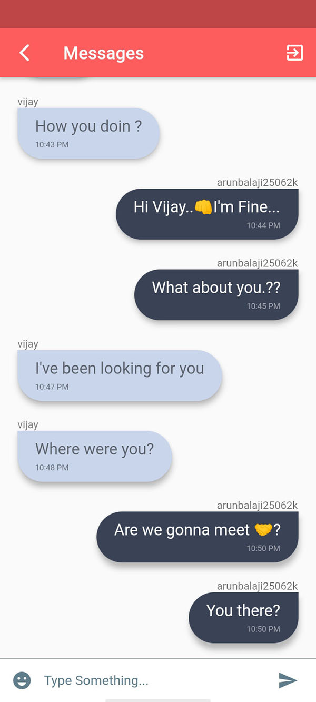
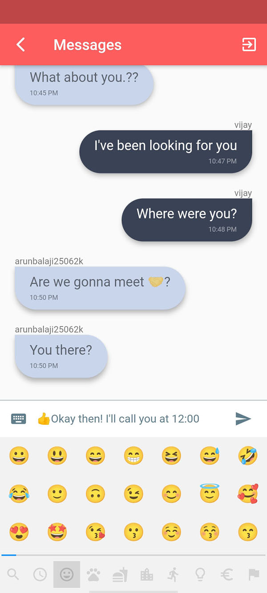

# Let's Chat -- clone from https://github.com/ArunBalajiR/Flutter-Chat-Application 

[](https://flutter.dev/)

It's a fully functional real-time chat application using stream and linking with Firebaes Firestore database built using flutter and firebase. Having nice looking UI and user-friendly animation.

## Screenshots


| Chat Screen                                                                                                           | Intro Screen                                                                                                          | Chat  Screen                                                                                                          |
|---------------------------------------------------------------------------------------------------------------------------|----------------------------------------------------------------------------------------------------------------------|----------------------------------------------------------------------------------------------------------------------|
|  |  |   |

## Features

- Sign in - SignUp - logout .
- Real-time send and receive messages using stream and linking with Firebaes Firestore database.
- Nice looking UI and user-friendly animation
-  Exchange texts with emojis


## Dependencies used
- [Flutter & Dart](http://flutter.dev)
- [Google Fonts](https://pub.dev/packages/google_fonts)
- [Firebase Core](https://pub.dev/packages/firebase_core)
- [Firebase Auth](https://pub.dev/packages/firebase_auth)
- [Cloud Firestore](https://pub.dev/packages/cloud_firestore)
- [Emoji Picker](https://pub.dev/packages/emoji_picker)

## How to run

- Clone this Repo
- Run ``` flutter packages get ```
```
flutter packages get
```
- Connect the app to your Firebase Project from your [Firebase Console](http://console.firebase.google.com) and add the `google-services.json` in the `/android/app` directory.
- Run ``` flutter run ``` (remember to open simulator or connect physical device, iOS auto run additional command pod install)
```
flutter run --release
```

## Beginners Guide

This project is a starting point for a Flutter application.

A few resources to get you started if this is your first Flutter project:

- [Lab: Write your first Flutter app](https://flutter.dev/docs/get-started/codelab)
- [Cookbook: Useful Flutter samples](https://flutter.dev/docs/cookbook)

For help getting started with Flutter, view our
[online documentation](https://flutter.dev/docs), which offers tutorials,
samples, guidance on mobile development, and a full API reference.
